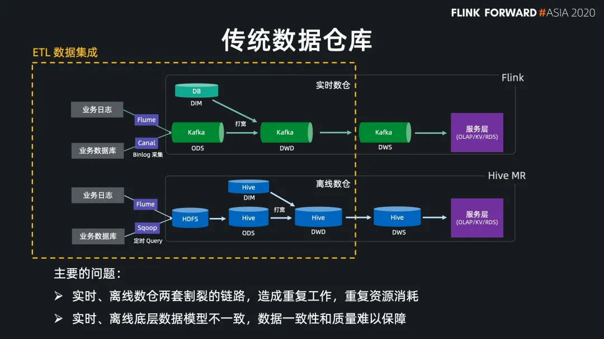
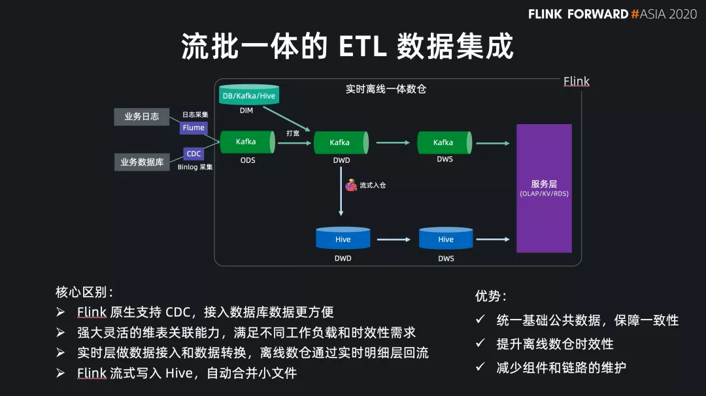
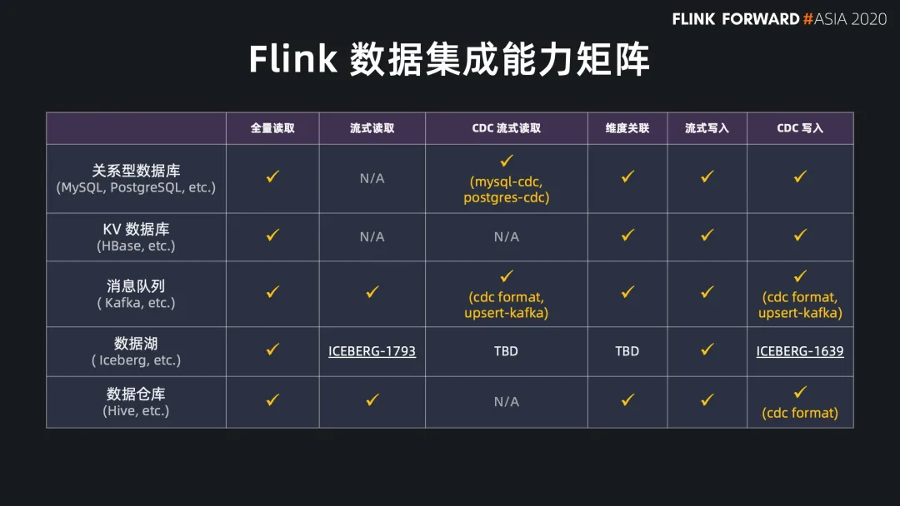
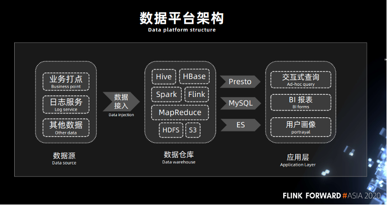
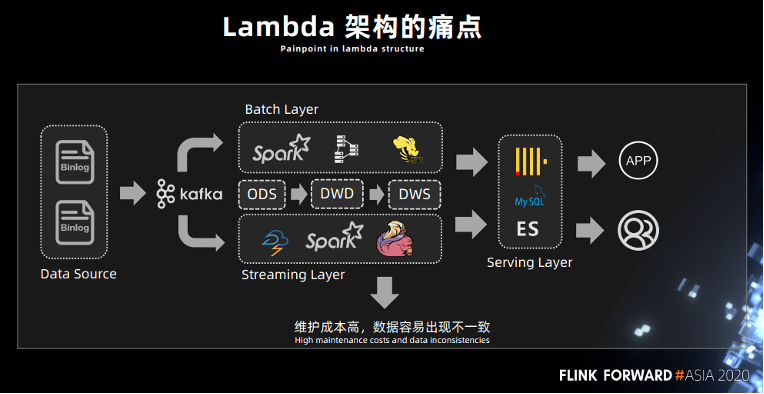
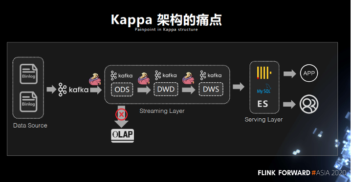
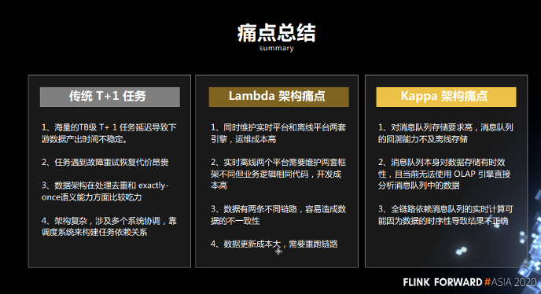
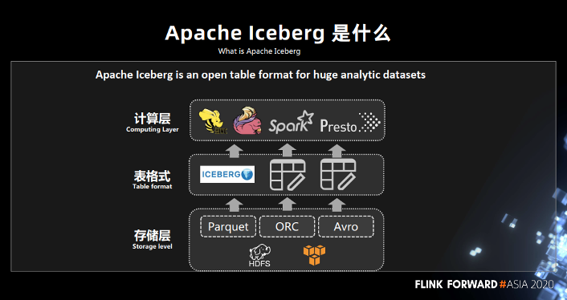
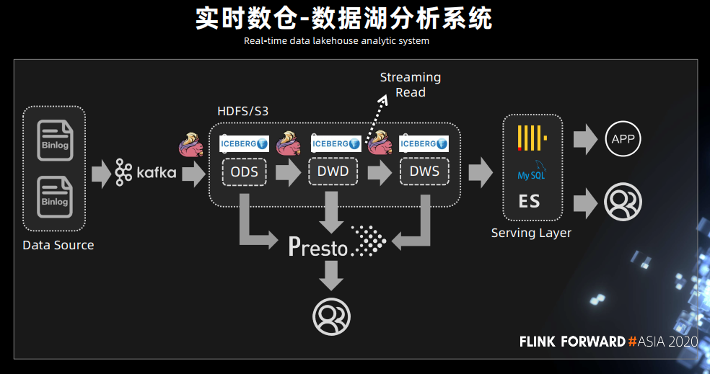
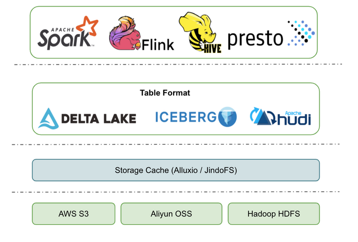

# 架构

- Impala、Presto、Spark SQL、Drill、Hawq
- Druid、Pinot
- Kylin

# 文档

[Flink 官方文档](https://ci.apache.org/projects/flink/flink-docs-stable/)

[Iceberg-flink-1.11.x](https://iceberg.apache.org/flink/#flink)

## 生产实践案例

[汽车之家：基于 Flink + Iceberg 的湖仓一体架构实践](https://flink-learning.org.cn/article/detail/8e580d78309ef019315f93f5de0802de?page=1)

[Flink + Iceberg，百亿级实时数据入湖实战](https://flink-learning.org.cn/article/detail/574b5f4618255552ecacb24c7c1ce8e8?page=1)

[Flink + Iceberg 在去哪儿的实时数仓实践](https://flink-learning.org.cn/article/detail/34be2ddba7eadcd85bcfcad9132f22be?page=1)

[Flink 集成 Iceberg 在同程艺龙的实践](https://flink-learning.org.cn/article/detail/86d2952400c103b4fe61cf4f2ed0391d?page=3)

[基于 Flink SQL 构建流批一体的 ETL 数据集成](https://flink-learning.org.cn/article/detail/e3ca19e7f09c90b8d7faf48eae5ed1d6?page=4)

[Flink + Iceberg 全场景实时数仓的建设实践](https://flink-learning.org.cn/article/detail/a80fb7f683fd82fff6e5ab009b9c7c1a?page=4)

[基于 Flink+Iceberg 构建企业级实时数据湖](https://segmentfault.com/a/1190000038802245)

[基于Flink CDC打通数据实时入湖](https://mp.weixin.qq.com/s/nvhK5VUn1MOXDt3_V8QyWg)

## 示例code

[Apache Iceberg 学习日志](https://xie.infoq.cn/article/61a82b983ef97c3e05a6e7d82)

[Apache Iceberg 的入门学习笔记](https://miaowenting.site/2021/01/20/Apache-Iceberg/)

[ Flink集成Iceberg简介](https://www.cnblogs.com/swordfall/p/14548574.html)

[Flink结合Kafka实时写入Iceberg实践笔记](https://zhengqiang.blog.csdn.net/article/details/112850376?utm_medium=distribute.pc_relevant.none-task-blog-2%7Edefault%7EBlogCommendFromBaidu%7Edefault-16.control&depth_1-utm_source=distribute.pc_relevant.none-task-blog-2%7Edefault%7EBlogCommendFromBaidu%7Edefault-16.control)

## kafka数据流式入库iceberg

[大数据技术与应用实战](https://cloud.tencent.com/developer/column/89247)

[Flink集成Iceberg小小实战](https://cloud.tencent.com/developer/article/1854696?from=article.detail.1770789)

## 官网与问题解决

[Flink 官网](https://ci.apache.org/projects/flink/flink-docs-release-1.11/zh/ops/deployment/local.html)
[Iceberg 官网](https://iceberg.apache.org/flink/)
[Iceberg Github](https://github.com/apache/iceberg)

> 问题解决：
- Github->issues
- Github->demo->example|Test
- google search
